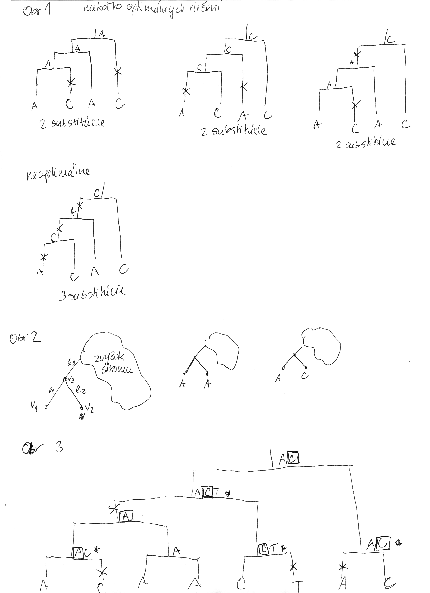

## Fylogenetické stromy

Terminológia:

  - zakorenený strom, rooted tree
  - nezakorenený strom, unrooted tree
  - hrana, vetva, edge, branch
  - vrchol, uzol, vertex, node
  - list, leaf, leaf node, tip, terminal node
  - vnútorný vrchol, internal node, branch point
  - koreň, root
  - podstrom, subtree, clade

Viď stránku https://www.khanacademy.org/science/ap-biology/natural-selection/phylogeny/a/phylogenetic-trees

Zopár faktov o stromoch

  - Majme zakorenený strom s n listami, v ktorom má každý vnútorný
    vrchol 2 deti. Takýto strom vždy má n-1 vnútorných vrcholov a 2n-2
    vetiev (prečo?)
  - Majme nezakorenený strom s n listami, v ktorom má každý vnútorný
    vrchol 3 susedov. Takýto strom vždy má n-2 vnútorných vrcholov a
    2n-3 vetiev
  - Koľkými spôsobmi môžeme zakoreniť nezakorenený strom s n listami?
      - koreň môže byť na hociktorej vetve stromu, teda je 2n-3 možností
        zakorenenia
  - Ak nakreslíme zakorenený strom obvyklým spôsobom, listy sú
    usporiadané zhora nadol (alebo zľava doprava). Koľko rôznych poradí
    listov vieme dostať rôznym zakresľovaním toho istého stromu s n
    listami?
      - máme n-1 vnutornych vrcholov, v kazdom mozeme vymenit lave a
        prave dieta. Pre kazdu konfiguraciu takychto vymen dostavame ine
        poradie, celkovy pocet poradi je 2n-1
  - Čo vieme zistiť o príbuznosti organizmov z nezakoreneného stromu
    (napr. kvartet 4 organizmov)?
      - skúsime zakoreniť všetkými spôsobmi a vidíme, že o žiadnych
        dvoch listoch nevieme povedať, že by boli sesterské (evolučne
        bližšie než ostatné), lebo koreň stromu môže byť zrovna na
        niektorej hrane vedúcej ku nim
      - vieme však zistiť, že niektoré dvojice sesterské nebudú

Iné použitie stromov v informatike:

  - uvidíme hierarchické zhlukovanie, bayesovské siete, ale tiež
    efektívne dátové štruktúry

## Bootstrap

  - Náhodne vyberieme niektoré stĺpce zarovnania, zostrojíme strom
    vybranou metódou
  - Celé to opakujeme veľa krát
  - Značíme si, koľkokrát sa ktorá vetva opakuje v stromoch, ktoré
    dostávame
      - Pri nezakorenených stromoch je vetva rozdelenie listov na dve
        skupiny (bipartícia)
  - Nakoniec zostavíme strom z celých dát a pozrieme sa ako často sa
    ktorá jeho vetva vyskytovala
      - Môžeme zostaviť aj strom z často sa vyskytujúcich hrán (napr.
        tých, ktoré sú vo viac ako 50% stromov)
  - Bootstrap hodnoty nám dajú určitý odhad spoľahlivosti, hlavne ak
    máme celkovo málo dát (krátke zarovnanie)
  - Ak však dáta nezodpovedajú vybranej metóde/modelu, tak aj pre zlý
    strom môžeme dostať vysoký bootstrap

Detail: pri náhodnom výbere stĺpcov pre bootstrap väčšinou používame
rovnaký počet stĺpcov ako pôvodné zarovnanie, pričom vzorkujeme z
pôvodného zarovnania s povolením opakovania stĺpca.

### Príklad

  - Robili sme 100x bootstrap, 40x sme dostali strom (i) na obrázku, 40x
    sme dostali strom (ii) a 20x sme dostali strom (iii)
  - Strom (iii) sme dostali aj spustením metody na celých dátach
  - Zistite úroveň bootstrap podpory pre jednotlivé vetvy stromu (iii)
  - Ktoré ďalšie vetvy majú podporu aspoň 20%?
  - Aký strom by sme dostali, ak by sme chceli nechať iba vetvy s
    podporou aspoň 80%?

## Opakovanie pravdepodobnostných modelov

Keď počítame pravdepodobnosť, rozmýšľame o myšlienkovom experimente, v
ktorom hádžeme kockou, ťaháme gulôčky z vreca a pod.

  - Dôležité je vždy si poriadne uvedomiť, ako tento experiment prebieha
  - Tieto myšlienkové experimenty však nastavujeme tak, aby
    odzrkadľovali nejaké aspekty reality, napr. skutočných DNA
    sekvencií, ich evolúcie a pod.
  - Takže pravdepodobnosti, ktoré spočítame v idealizovanom svete nám
    možno niečo povedia o reálnom svete
  - Slávny citát štatistika Georga Boxa "All models are wrong, but some
    are useful."

Aké sme doteraz videli modely

  - Skórovacie matice: porovnávame model náhodných sekvencií a model
    náhodných zarovnaní
  - E-value v BLASTe: náhodne vygenerujeme databázu a dotaz (query),
    koľko bude v priemere medzi nimi lokálnych zarovnaní so skóre aspoň
    S?
  - Hľadanie génov: model generujúci sekvenciu+anotáciu naraz (parametre
    nastavené na známych génoch). Pre danú sekvenciu, ktorá anotácia je
    najpravdepodobnejšia?
  - Evolúcia, Jukes-Cantorov model: model generujúci stĺpec zarovnania.
    Neznáme parametre: strom, dĺžky hrán. Pre danú sadu stĺpcov
    zarovnania, ktoré parametre povedú k najväčšej pravdepodobnosti?
    $\max_{param} \Pr(data|param)$
      - Trochu detailov: pravdepodobnosť zmeny/nezmeny na hrane dĺžky t:
        $P(A|A,t) = (1+3e^{-\frac{4}{3} t})/4$,
        $P(C|A,t)=(1-e^{-\frac{4}{3} t})/4$
      - Ak poznáme ancestrálne sekvencie, vieme spočítať pravdepodobnosť
        dát
      - Ancestrálne sekvencie sú náhodné premenné, ktoré nás
        nezaujímajú: marginalizujeme ich (uvažujeme všetky ich možné
        hodnoty)

## Zložitejšie evolučné modely

  - Jukes-Cantorov model uvažuje len dĺžku hrany udanú ako priemerný
    počet substitúcií (vrátane tých, ktore nevidíme, kvôli tomu, že
    boli dve na tom istom mieste)
  - Nie všetky substitúcie sa dejú rovnako často: tranzície (v rámci
    pyrimidínov T\<-\>C, v rámci purínov A\<-\>G) sú pravdepodobnejšie
    ako tranzverzie (A,G)\<-\>(C,T)
  - Nie všetky nukleotidy sa v danom genóme vyskytujú rovnako často
    (napr. mitochondriálne genómy majú nízky obsah GC)
  - Tieto javy zachytáva HKY model (Hasegawa, Kishino & Yano)
  - Matica rýchlostí zmeny (substitution rate matrix)

$\left(
\begin{array}{cccc}
-\mu_A & \beta\pi_C & \alpha\pi_G & \beta\pi_T\\\\\\\\
\beta\pi_A & -\mu_C & \beta\pi_G & \alpha\pi_T\\\\\\\\
\alpha\pi_A & \beta\pi_C & -\mu_G & \beta\pi_T\\\\\\\\
\beta\pi_A & \alpha\pi_C & \beta\pi_G & -\mu_T\\\\\\\\
\end{array}
\right)$

  - $\kappa=\alpha/\beta$ je pomer rýchlostí, ktorými sa deju
    tranzície vs. transverzie
  - $\pi_j$ je frekvencia bazy $j$ v sekvencii
  - Rýchlosť, ako sa deje substitúcia z X do Y je súčin pravdepodobnosti
    Y a faktoru, ktorý zavisí od toho, či ide o tranzíciu alebo
    transverziu
  - Súčet každého riadku matice má byť 0, t.j.
    $\mu_A=\beta\pi_C + \alpha\pi_G + \beta\pi_T$
  - Matica sa znormalizuje tak, aby priemerný počet substitúcii za
    jednotku času bol 1
  - Matica ma styri parametre: $\kappa$ a tri frekvencie (stvrta musi
    doplnit do 1) plus dlzka hrany
  - Zlozitejsi model lepsie zodpoveda skutocnym procesom, ale na odhad
    viac parametrov potrebujeme viacej dat.
  - Existuju metody, ktore pre dany cas t z matice rychlosti spocitaju
    pravdepodobnost, ze baza X zmutuje na bazu Y Pr(Y|X,t)
  - Napr. pre velmi maly cas $\epsilon$ mame $\Pr(C|A,\epsilon)$ je
    zhruba $\epsilon\beta\pi_C$
  - Pre rozumne dlhe casy toto neplati, preto sa pouzivaju algebraicke
    metódy, ktoré berú do úvahy možnosť viacerých substitúcií na tom
    istom mieste
  - Je aj vela inych modelov s mensim alebo vacsim poctom parametrov

## Fitchov algoritmus

Nerobili sme, uvedene pre zaujimavost

  - **Parsimony/uspornost**
      - Vstup: fylogeneticky strom, 1 stlpec zarovnania (jedna baza v
        kazdom liste stromu)
      - Vystup: priradenie baz predkom minimalizujuce pocet substitucii
  - Priklad - obr 1
  - Uvazujme, co vieme povedat o strome s dvoma susednymi listami vo
    vacsom strome (oznacenie: obr. 2, listy v1 a v2, hrany do listov e1,
    e2, ich predok v3, hrana z v3 vyssie e3).
  - Ak oba listy maju bazu rovnaku bazu, napr. A, predok v3 v optimalnom
    rieseni bude urcite mat bazu A
      - Dokaz sporom: nech to tak nie je, nech optimalne riesenie ma
        nejaku inu bazu, napr. C. Vymenme v tomto rieseni toto C za A.
        Moze nam pribudnut jedna mutacia na hrane e3, ale ubudnu dve na
        hranach e1 a e2. Tym celkova cena riesenia klesne o 1, takze
        nebolo optimalne.
  - Ak tieto dva listy maju rozne bazy, napr. A a C, tak existuje
    optimalne riesenie, ktore ma v predkovi v3 bazu A alebo C.
      - Dokaz: vezmime optimalne riesenie. Ak ma v3 bazu A alebo C,
        tvrdenie plati. Ak ma v3 nejaku inu bazu, napr T, mozeme ju
        vymenit napr. za A, ci mozno pribudne jedna mutacia na e3 ale
        urcite ubudne mutacia na e1. Teda celkovy pocet mutacii sa
        nezvysi a nase nove riesenie je stale optimalne. Pozor, vo
        vseobecnosti nevieme povedat, ci ma v3 mat bazu A alebo C. V
        niektorych pripadoch su optimalne obe, v niektorych len jedna z
        nich.

  - **Fitchov algoritmus 1971**
  - Kazdemu vrcholu v priradime mnozinu baz M(v)
  - M(v) pocitame od listov smerom ku korenu
  - Pre list v bude M(v) obsahovat bazu v tomto liste
  - Uvazujme vnutorny vrchol v s detmi x a y. Mame uz spocitane M(x) a
    M(y), chceme M(v)
  - Ak M(x) a M(y) maju nejake spolocne bazy, vsetky tieto spolocne bazy
    dame do M(v), t.j. $M(v) = M(x) \cap M(y)$
  - Ak M(x) a M(y) nemaju spolocne bazy, do M(v) dame vsetky bazy z M(x)
    aj M(v), t.j. $M(v) = M(x) \cup M(y)$
      - V tomto pripade pocet mutacii vzrastie o jedna
  - Ked mame M(v) spocitane pre vsetky vrcholy, ideme od korena smerom k
    listom a vyberieme vzdy jednu bazu z M(v).
  - Ak sme vybrali pre rodica bazu x a x je v M(v), zvolime x aj pre v,
    inak zvolime lubovolnu bazu z M(v).
  - Priklad algoritmu na obr 3
